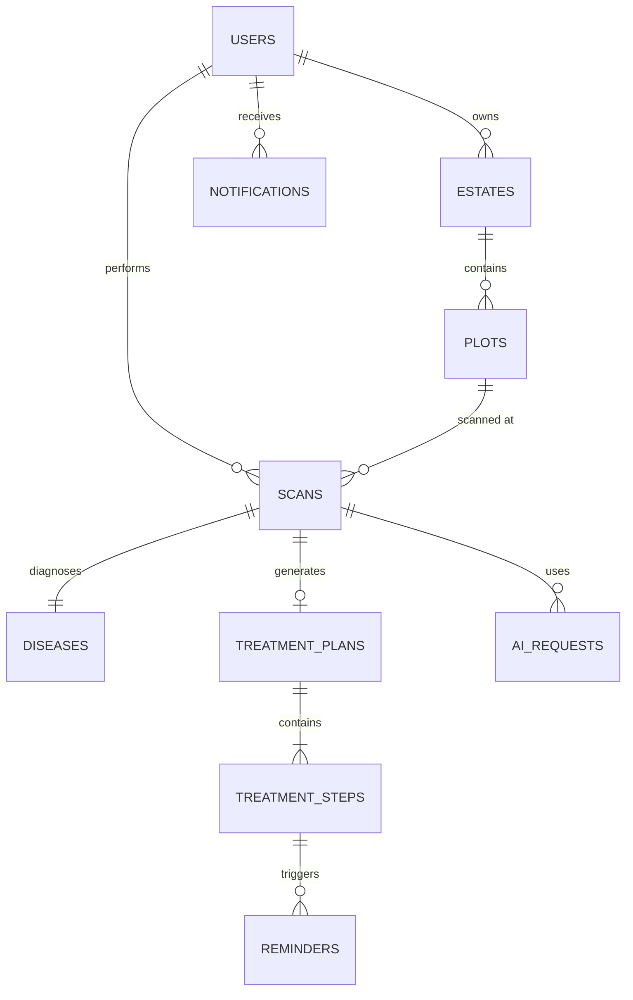
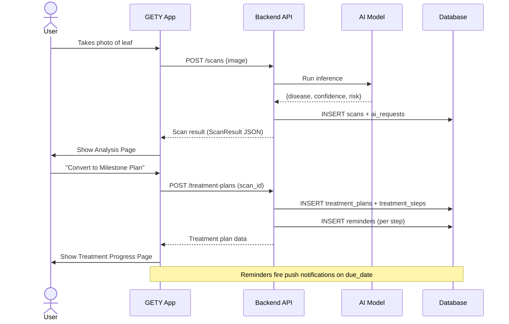

# GETY / LatexGuard — Database Design

> **App Summary**: GETY is a rubber estate leaf disease detection app. Users scan rubber tree leaves, get AI-powered disease diagnoses, and follow structured treatment plans tracked over time.

---

## Entity Relationship Overview



---

## Tables / Collections

### 1. `users`

Stores registered user accounts.

| Column | Type | Constraints | Description |
|---|---|---|---|
| [id](file:///c:/Users/mohda/OneDrive/Documents/Visual%20Studio%20Code/fyp/GETY/context/ScanContext.tsx#97-158) | `UUID` | PK | Unique user ID |
| `full_name` | `VARCHAR(100)` | NOT NULL | e.g. "Adli Mohd" |
| `email` | `VARCHAR(255)` | UNIQUE, NOT NULL | Login email |
| `password_hash` | `TEXT` | NOT NULL | bcrypt hashed |
| `avatar_url` | `TEXT` | NULLABLE | Profile photo URL |
| `role` | `ENUM` | DEFAULT `'estate_owner'` | `estate_owner`, `agronomist`, `admin` |
| `created_at` | `TIMESTAMP` | DEFAULT NOW() | Account creation |
| `updated_at` | `TIMESTAMP` | AUTO UPDATE | Last profile change |

---

### 2. `estates`

A user can manage one or more rubber estates.

| Column | Type | Constraints | Description |
|---|---|---|---|
| [id](file:///c:/Users/mohda/OneDrive/Documents/Visual%20Studio%20Code/fyp/GETY/context/ScanContext.tsx#97-158) | `UUID` | PK | Unique estate ID |
| `owner_id` | `UUID` | FK → users.id | Owner reference |
| `name` | `VARCHAR(150)` | NOT NULL | e.g. "Ladang Belum" |
| `location` | `TEXT` | NULLABLE | Full address or GPS coords |
| `hectares` | `DECIMAL(8,2)` | NULLABLE | Total estate size |
| `created_at` | `TIMESTAMP` | DEFAULT NOW` | |

---

### 3. `plots`

Sub-sections within an estate (e.g. "North Plot B-12").

| Column | Type | Constraints | Description |
|---|---|---|---|
| [id](file:///c:/Users/mohda/OneDrive/Documents/Visual%20Studio%20Code/fyp/GETY/context/ScanContext.tsx#97-158) | `UUID` | PK | |
| `estate_id` | `UUID` | FK → estates.id | Parent estate |
| `name` | `VARCHAR(100)` | NOT NULL | e.g. "Block A", "Sector B" |
| `area_hectares` | `DECIMAL(6,2)` | NULLABLE | Size of this plot |
| `gps_lat` | `DECIMAL(10,6)` | NULLABLE | Center GPS latitude |
| `gps_lng` | `DECIMAL(10,6)` | NULLABLE | Center GPS longitude |
| `tree_count` | `INTEGER` | NULLABLE | Estimated trees in plot |
| `created_at` | `TIMESTAMP` | DEFAULT NOW() | |

---

### 4. `diseases`

Master reference table of all detectable leaf diseases.

| Column | Type | Constraints | Description |
|---|---|---|---|
| [id](file:///c:/Users/mohda/OneDrive/Documents/Visual%20Studio%20Code/fyp/GETY/context/ScanContext.tsx#97-158) | `UUID` | PK | |
| `name` | `VARCHAR(200)` | UNIQUE, NOT NULL | e.g. "Pestalotiopsis Leaf Fall" |
| `scientific_name` | `VARCHAR(200)` | NULLABLE | Latin name |
| `description` | `TEXT` | NOT NULL | Full disease description |
| `risk_level` | `ENUM` | NOT NULL | `'Low'`, `'Medium'`, `'High'` |
| `recommended_fungicide` | `VARCHAR(100)` | NULLABLE | e.g. "Mancozeb 80WP" |
| `water_mix_ratio` | `VARCHAR(50)` | NULLABLE | e.g. "20L Water Mix" |
| `default_day_plan` | `INTEGER` | DEFAULT 14 | Standard treatment duration |
| `follow_up_days` | `INTEGER` | DEFAULT 14 | Days until re-scan recommended |
| `prevention_tips` | `JSONB` | NULLABLE | Array of `{title, desc}` objects |
| `what_to_do` | `JSONB` | NULLABLE | Array of action strings |

---

### 5. `scans`

Every leaf scan performed by a user.

| Column | Type | Constraints | Description |
|---|---|---|---|
| [id](file:///c:/Users/mohda/OneDrive/Documents/Visual%20Studio%20Code/fyp/GETY/context/ScanContext.tsx#97-158) | `UUID` | PK | |
| `user_id` | `UUID` | FK → users.id | Who scanned |
| `plot_id` | `UUID` | FK → plots.id, NULLABLE | Where it was scanned |
| `disease_id` | `UUID` | FK → diseases.id, NULLABLE | Matched disease (NULL if healthy) |
| `image_url` | `TEXT` | NOT NULL | Stored image URI (S3 / Supabase Storage) |
| `confidence` | `DECIMAL(5,2)` | NOT NULL | AI confidence 0.00–100.00 |
| `risk_level` | `ENUM` | NOT NULL | `'Low'`, `'Medium'`, `'High'`, `'Healthy'` |
| `scan_date` | `DATE` | NOT NULL DEFAULT CURRENT_DATE | Date leaf was scanned |
| `scan_lat` | `DECIMAL(10,6)` | NULLABLE | Exact GPS latitude of the scanned tree |
| `scan_lng` | `DECIMAL(10,6)` | NULLABLE | Exact GPS longitude of the scanned tree |
| `scan_address` | `TEXT` | NULLABLE | Reverse-geocoded label e.g. "Jalan Ladang, Perak" |
| `location_label` | `VARCHAR(100)` | NULLABLE | Human label e.g. "North Plot B-12" |
| `notes` | `TEXT` | NULLABLE | User field notes |
| `is_saved` | `BOOLEAN` | DEFAULT FALSE | Whether user explicitly saved it |
| `created_at` | `TIMESTAMP` | DEFAULT NOW() | |

> **GPS Note**: The user taps **"Tap to Tag GPS Location"** on the Analysis page. `expo-location` captures device coordinates at `Accuracy.High` and reverse-geocodes them to a human-readable address. All 3 GPS fields are stored in the scan record and displayed in History and Detail History pages.

> **Indexes**:
> ```sql
> CREATE INDEX idx_scans_user_date ON scans(user_id, scan_date DESC);
> CREATE INDEX idx_scans_gps ON scans(scan_lat, scan_lng) WHERE scan_lat IS NOT NULL;
> ```

---

### 6. `treatment_plans`

A treatment plan generated from a single scan.

| Column | Type | Constraints | Description |
|---|---|---|---|
| [id](file:///c:/Users/mohda/OneDrive/Documents/Visual%20Studio%20Code/fyp/GETY/context/ScanContext.tsx#97-158) | `UUID` | PK | |
| `scan_id` | `UUID` | FK → scans.id, UNIQUE | One plan per scan |
| `user_id` | `UUID` | FK → users.id | Owner reference |
| `disease_id` | `UUID` | FK → diseases.id | Disease being treated |
| `fungicide` | `VARCHAR(100)` | NOT NULL | Applied fungicide name |
| `water_mix` | `VARCHAR(50)` | NULLABLE | Mix ratio |
| `day_plan` | `INTEGER` | NOT NULL | Total duration in days |
| `start_date` | `DATE` | NOT NULL | When treatment began |
| `end_date` | `DATE` | COMPUTED | `start_date + day_plan` |
| `status` | `ENUM` | DEFAULT `'active'` | `'active'`, `'completed'`, `'abandoned'` |
| `progress_pct` | `DECIMAL(5,2)` | DEFAULT 0.00 | 0–100, computed from step completion |
| `created_at` | `TIMESTAMP` | DEFAULT NOW() | |

---

### 7. `treatment_steps`

Individual milestone steps within a treatment plan.

| Column | Type | Constraints | Description |
|---|---|---|---|
| [id](file:///c:/Users/mohda/OneDrive/Documents/Visual%20Studio%20Code/fyp/GETY/context/ScanContext.tsx#97-158) | `UUID` | PK | |
| `plan_id` | `UUID` | FK → treatment_plans.id | Parent plan |
| `step_order` | `INTEGER` | NOT NULL | Sort order (1, 2, 3…) |
| `title` | `VARCHAR(150)` | NOT NULL | e.g. "Initial Application" |
| `description` | `TEXT` | NOT NULL | Detailed instructions |
| `status` | `ENUM` | DEFAULT `'upcoming'` | `'upcoming'`, `'current'`, `'completed'` |
| `due_date` | `DATE` | NULLABLE | When this step should be done |
| `completed_at` | `TIMESTAMP` | NULLABLE | When user marked it done |
| `created_at` | `TIMESTAMP` | DEFAULT NOW() | |

> **Index**: [(plan_id, step_order ASC)](file:///c:/Users/mohda/OneDrive/Documents/Visual%20Studio%20Code/fyp/GETY/app/%28tabs%29/index.tsx#21-176) for timeline queries.

---

### 8. `reminders`

Scheduled notifications tied to treatment steps.

| Column | Type | Constraints | Description |
|---|---|---|---|
| [id](file:///c:/Users/mohda/OneDrive/Documents/Visual%20Studio%20Code/fyp/GETY/context/ScanContext.tsx#97-158) | `UUID` | PK | |
| `user_id` | `UUID` | FK → users.id | Recipient |
| `step_id` | `UUID` | FK → treatment_steps.id, NULLABLE | Related step |
| `title` | `VARCHAR(200)` | NOT NULL | Reminder title |
| `body` | `TEXT` | NULLABLE | Full reminder message |
| `priority` | `ENUM` | DEFAULT `'Medium'` | `'High'`, `'Medium'`, `'Low'` |
| `scheduled_at` | `TIMESTAMP` | NOT NULL | When to fire the reminder |
| `is_sent` | `BOOLEAN` | DEFAULT FALSE | Whether push notification was sent |
| `is_dismissed` | `BOOLEAN` | DEFAULT FALSE | User dismissed it |
| `created_at` | `TIMESTAMP` | DEFAULT NOW() | |

> **Index**: [(user_id, scheduled_at ASC, is_sent)](file:///c:/Users/mohda/OneDrive/Documents/Visual%20Studio%20Code/fyp/GETY/app/%28tabs%29/index.tsx#21-176) for upcoming reminder queries.

---

### 9. `ai_requests`

Audit log of every AI model inference call.

| Column | Type | Constraints | Description |
|---|---|---|---|
| [id](file:///c:/Users/mohda/OneDrive/Documents/Visual%20Studio%20Code/fyp/GETY/context/ScanContext.tsx#97-158) | `UUID` | PK | |
| `scan_id` | `UUID` | FK → scans.id | Associated scan |
| `model_version` | `VARCHAR(50)` | NOT NULL | e.g. "gety-v2.1" |
| `input_image_url` | `TEXT` | NOT NULL | Image sent to model |
| `raw_response` | `JSONB` | NULLABLE | Full model response JSON |
| `disease_predicted` | `VARCHAR(200)` | NULLABLE | Top prediction |
| `confidence` | `DECIMAL(5,2)` | NULLABLE | Top prediction confidence |
| `latency_ms` | `INTEGER` | NULLABLE | Inference time in ms |
| `status` | `ENUM` | DEFAULT `'success'` | `'success'`, `'failed'`, `'timeout'` |
| `created_at` | `TIMESTAMP` | DEFAULT NOW() | |

---

### 10. `notifications`

In-app notification centre log.

| Column | Type | Constraints | Description |
|---|---|---|---|
| [id](file:///c:/Users/mohda/OneDrive/Documents/Visual%20Studio%20Code/fyp/GETY/context/ScanContext.tsx#97-158) | `UUID` | PK | |
| `user_id` | `UUID` | FK → users.id | Target user |
| `type` | `ENUM` | NOT NULL | `'scan_result'`, `'treatment_reminder'`, `'system'`, `'tip'` |
| `title` | `VARCHAR(200)` | NOT NULL | Short heading |
| `body` | `TEXT` | NULLABLE | Full message |
| `related_id` | `UUID` | NULLABLE | References scans.id or treatment_plans.id |
| `is_read` | `BOOLEAN` | DEFAULT FALSE | |
| `created_at` | `TIMESTAMP` | DEFAULT NOW() | |

> **Index**: [(user_id, is_read, created_at DESC)](file:///c:/Users/mohda/OneDrive/Documents/Visual%20Studio%20Code/fyp/GETY/app/%28tabs%29/index.tsx#21-176) for unread badge count.

---

## Relationships Summary

| Relationship | Type | Notes |
|---|---|---|
| `users` → `estates` | 1-to-many | A user can own multiple estates |
| `estates` → `plots` | 1-to-many | Each estate has multiple plots |
| `users` → `scans` | 1-to-many | All scans belong to a user |
| `plots` → `scans` | 1-to-many (optional) | Scans can be tagged to a plot |
| `scans` → `diseases` | many-to-1 (optional) | Null if leaf is healthy |
| `scans` → `treatment_plans` | 1-to-1 (optional) | Only created if user converts scan |
| `treatment_plans` → `treatment_steps` | 1-to-many | Ordered list of steps |
| `treatment_steps` → `reminders` | 1-to-many (optional) | Reminder per step |
| `scans` → `ai_requests` | 1-to-many | Includes retries |
| `users` → `notifications` | 1-to-many | All in-app alerts |

---

## Data Flow: Scan → Treatment → Reminder



---

## Recommended Indexes

```sql
-- For history list (most recent scans first)
CREATE INDEX idx_scans_user_date ON scans(user_id, scan_date DESC);

-- For GPS spatial lookups (only rows where GPS was captured)
CREATE INDEX idx_scans_gps ON scans(scan_lat, scan_lng) WHERE scan_lat IS NOT NULL;

-- For treatment step timeline
CREATE INDEX idx_steps_plan_order ON treatment_steps(plan_id, step_order ASC);

-- For upcoming reminders
CREATE INDEX idx_reminders_user_scheduled ON reminders(user_id, scheduled_at ASC, is_sent);

-- For unread notification badge
CREATE INDEX idx_notifications_user_unread ON notifications(user_id, is_read, created_at DESC);
```

---

## Implementation Notes

> [!NOTE]
> The current app uses **React Context ([ScanContext](file:///c:/Users/mohda/OneDrive/Documents/Visual%20Studio%20Code/fyp/GETY/context/ScanContext.tsx#77-85))** as an in-memory store (no backend yet). The schema above is designed to be a **drop-in target** when you connect a real database.

> [!TIP]
> **Recommended stack for this FYP:**
> - **Database**: [Supabase](https://supabase.com) (PostgreSQL + Auth + Storage) — free tier is generous and Expo-compatible
> - **Image Storage**: Supabase Storage buckets (or Firebase Storage)
> - **Auth**: Supabase Auth (email/password + Google OAuth)
> - **AI Backend**: Python FastAPI with a trained TensorFlow/PyTorch model, deployed on Railway or Render

> [!IMPORTANT]
> The `diseases` table should be **pre-seeded** with known rubber tree diseases before launch. Current known diseases in the app:
> - Pestalotiopsis Leaf Fall
> - Rubber Powdery Mildew (Oidium heveae)
> - Phytophthora Leaf Blight
> - Colletotrichum Leaf Disease

> [!WARNING]
> The `treatment_plans.progress_pct` column should be **computed via a trigger or view**, not manually updated, to avoid data inconsistency between the steps and the plan-level percentage.
